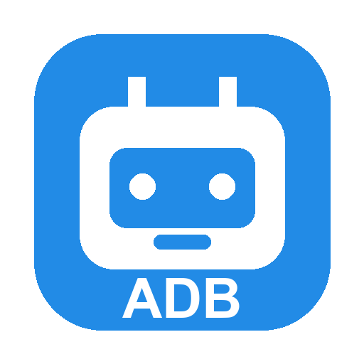
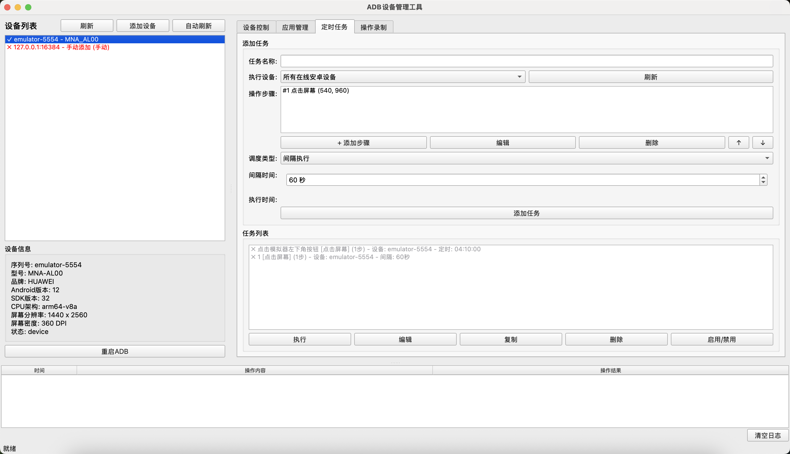

# ADB Devtools

<p align="center">
  
</p>

<p align="center">
  一款适用于 macOS (Apple Silicon) 的 ADB 设备管理桌面工具
</p>

<p align="center">
  
  
  
  
</p>

<p align="center">
  
</p>

---

## 功能特性

### 设备管理
- 自动发现已连接的 Android 设备/模拟器
- 手动添加设备（支持 IP:端口、序列号等多种格式）
- 设备信息展示（型号、品牌、Android 版本、屏幕分辨率等）
- 设备配置持久化，自动刷新设备列表

### 设备控制
- **屏幕操作**：点击、滑动、长按
- **按键模拟**：返回、主页、菜单、音量调节、电源键
- **截屏功能**：一键截取设备屏幕
- **坐标拾取**：可视化从设备截图上拾取坐标，支持缩放

### 应用管理
- 安装 APK 文件
- 查看已安装应用列表（支持中文应用名显示）
- 启动/停止应用
- 卸载应用（带确认提示）

### 定时任务
- 创建定时任务，支持**间隔执行**和**定时执行**两种模式
- 多步骤操作序列（点击、滑动、输入文本、按键、截屏、启停应用）
- 图像匹配触发任务：实时截图框选目标样本，定时扫描屏幕，识别到后执行自定义操作
- 任务可指定执行设备（单个设备或所有在线设备）
- 任务的启用/禁用、编辑、复制、删除

### 操作录制
- 实时投屏显示设备画面
- 在投屏画面上点击即可录制操作步骤
- 录制完成后可保存为定时任务

---

## 环境要求

| 依赖 | 版本要求 |
|------|---------|
| 操作系统 | macOS (Apple Silicon / M 系列芯片) |
| Python | 3.9+ |
| ADB | android-platform-tools |

---

## 安装

### 1. 安装 ADB

```bash
brew install android-platform-tools
```

### 2. 克隆项目

```bash
git clone https://github.com/yourusername/AdbDevtools.git
cd AdbDevtools
```

### 3. 安装 Python 依赖

```bash
pip install -r requirements.txt
```

---

## 使用

### 启动程序

```bash
# 确保模拟器/设备已启动并连接
python main.py
```

### 基本操作流程

1. 启动程序后，左侧设备列表会自动显示已连接的设备
2. 点击选择要操作的设备
3. 使用右侧控制面板进行各种操作：
   - **设备控制**：执行点击、滑动、截屏等操作
   - **应用管理**：安装、启动、卸载应用
   - **定时任务**：创建和管理自动化任务
   - **操作录制**：录制操作并保存为任务

### 快捷键

| 快捷键 | 功能 |
|--------|------|
| `Ctrl+R` | 刷新设备列表 |
| `Ctrl+Q` | 退出程序 |

---

## 项目结构

```
AdbDevtools/
├── main.py                  # 主入口
├── requirements.txt         # Python 依赖
├── assets/
│   └── app_icon.png         # 应用图标
├── core/
│   ├── adb_manager.py       # ADB 核心管理器
│   └── log_entry.py         # 日志条目数据类
├── ui/
│   ├── main_window.py       # 主窗口布局
│   ├── device_panel.py      # 设备列表面板
│   ├── control_panel.py     # 控制面板（设备控制/应用管理/定时任务/操作录制）
│   ├── log_panel.py         # 日志面板
│   ├── coordinate_picker.py # 坐标拾取对话框
│   ├── task_edit_dialog.py  # 任务编辑对话框
│   └── step_edit_dialog.py  # 步骤编辑对话框
└── tasks/
    └── task_manager.py      # 定时任务管理器
```

---

## 按键码参考

| 按键 | 键码 |
|------|------|
| 返回 | 4 |
| 主页 | 3 |
| 菜单 | 82 |
| 音量+ | 24 |
| 音量- | 25 |
| 电源 | 26 |

---

## 技术栈

- **Python 3.9+** - 主要编程语言
- **PyQt6** - GUI 框架
- **Pillow** - 图像处理
- **ADB** - Android 调试桥

---

## 许可证

本项目基于 MIT 许可证开源。详见 [LICENSE](LICENSE) 文件。

---

## 贡献

欢迎提交 Issue 和 Pull Request！

1. Fork 本仓库
2. 创建你的特性分支 (`git checkout -b feature/AmazingFeature`)
3. 提交你的更改 (`git commit -m 'Add some AmazingFeature'`)
4. 推送到分支 (`git push origin feature/AmazingFeature`)
5. 打开一个 Pull Request

---

## 致谢

- [Android Debug Bridge (ADB)](https://developer.android.com/tools/adb)
- [PyQt6](https://riverbankcomputing.com/software/pyqt/)
- [Pillow](https://python-pillow.org/)
